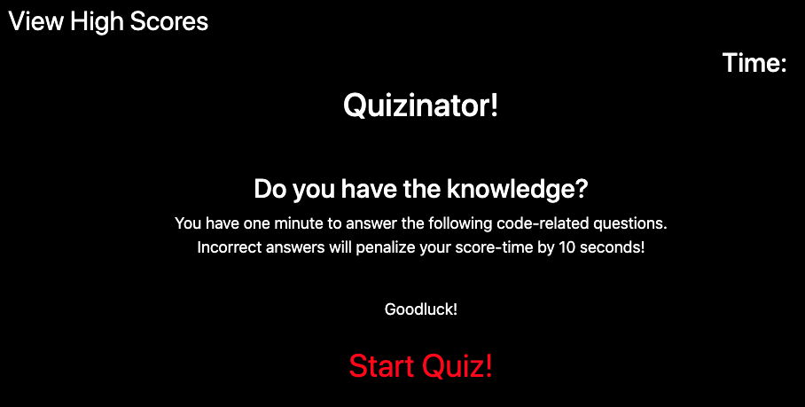

# Quizinator

## A quiz that tests your coding knowledge! 

Deployed Application: https://ellysecarter.github.io/quizinator/

## Table of Contents 

* [Description](#description)
* [Technologies used](#technologies-used)
* [Installation](#installation)
* [Known bugs](#known-bugs)
* [Contact](#contact)

## Description

This site is a timed quiz of 5 coding questions.

Whether you get the answer right or wrong, it will give you an alert and move on to the next question. However, if the answer is wrong, ten seconds are deducted from your time.

Your time left is your score.

At the end of the quiz, you can input your initials to save your score.

You can select the button "View High Scores" to see the high scores that are saved in the local storage.

You can select "Clear High Scores" to clear the high score list.

You can select "Play Again" to start the quiz from the beginning. 

## Technologies Used
* HTML
* CSS
* JavaScript

## Installation

Go to https://github.com/ellysecarter/quizinator and clone the repo with either your SSH key or with HTTPS. Next, go to the terminal on your computer and type in "git clone" and paste the key. After that, open the application in your VS code or another code application that you use. 

You can also go straight to the deployed application here: https://ellysecarter.github.io/quizinator/

## Known Bugs
 

## Contact 

If you have any questions or would like to contribute to this project please reach out to me at ellysecarter@yahoo.com or [@ellysecarter](https://github.com/ellysecarter)